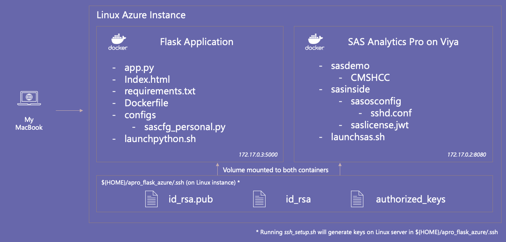

### Running CMS Risk Adjustment Models with SAS Analytics Pro (Viya) on Azure

# 0 - Introduction

This repository is an asset for those that want to install and configure SAS Analytics Pro (Viya) on Azure and connect to third party applications via SSH.

Here is what you will be able to accomplish:

1)	Deploy an Azure instance with Ubuntu
2)	Install Docker on this instance
3)	Clone the GitHub repository
4)	Install SAS Analytics Pro on Viya
5)	Configure password-less SSH on the SAS Analytics Pro Viya
6)	Build the container for the Flask application
7)	Run the Flask application container 
8)	Test password-less SHS from the Flask container to the SAS Analytics Pro on Viya
9)	Configure ports on the Azure instance to make sure it is accessible from my machine
10)	Run the application on the browser to score new patients
___
You can watch the video below for more detailed explanation on each step.

[](https://www.youtube.com/watch?v=NLIs4cTVQjU)

___
Here it is a overview of this repo.



___
## 1 - Install Docker

```shell
sudo apt-get update

sudo apt-get install \
    ca-certificates \
    curl \
    gnupg \
    lsb-release

curl -fsSL https://download.docker.com/linux/ubuntu/gpg | sudo gpg --dearmor -o /usr/share/keyrings/docker-archive-keyring.gpg

echo "deb [arch=$(dpkg --print-architecture) signed-by=/usr/share/keyrings/docker-archive-keyring.gpg] https://download.docker.com/linux/ubuntu $(lsb_release -cs) stable" | sudo tee /etc/apt/sources.list.d/docker.list > /dev/null

sudo apt-get update

sudo apt-get install docker-ce docker-ce-cli containerd.io
```

## 2 - Get Project Files

```shell
git clone https://github.com/ldepaula3/apro_flask_azure.git
```

## 2.1 - Get your SAS license file (.jwt) and paste inside aprocontainer/sasinside/ directory

## 3 - Download images from SAS Mirror

```shell
sudo docker pull [SAS Mirror]/viya-4-x64_oci_linux_2-docker/sas-analytics-pro:[TAG]
```

## 4 - Set Permissions & configure SSH - generate keys

```shell
cd apro_flask_azure 

chmod 777 ssh_setup.sh

./ssh_setup.sh
```

## 5 - Run SAS Analytics Pro on Viya Container

** note: you will have to edit the file launchsas.sh (lines 3 and 11) to match the **image mirror, tag and license filename**.

```shell
cd aprocontainer 

./launchsas.sh

sudo docker logs -f sas-analytics-pro

docker inspect -f '{{range.NetworkSettings.Networks}}{{.IPAddress}}{{end}}' sas-analytics-pro
```

## 6 - Get inside SAS Analytics Pro on Viya container and set permissions on keys/folders

```shell

sudo docker exec -it sas-analytics-pro bash

su sasdemo

chmod -R 700 /data

cd data/.ssh

chmod 600 authorized_keys id_rsa id_rsa.pub 
```

## 6.1 (optional) - Test SSH connection

```shell
ssh localhost 
```
___
### Exit and go back to linux machine where docker is running 
___

## 7 - Build Simple-Flask container

```shell
cd ../simple-flask

sudo docker build --tag python-docker . 
```

## 8 - Run Simple-Flask Application container

```shell
./launchpython.sh
```

## 9 - Check if Simple-Flask can connect to SAS Analytics Pro container

** make sure the IP address here matches the one on **simple-flask/configs/sascfg_personal.py**

```shell
cd /root/.ssh

ssh sasdemo@172.17.0.2
```

## 10 (optional) - Inspect logs from Simple-Flask container

```shell
sudo docker logs -f [CONTAINER_ID]
```

___